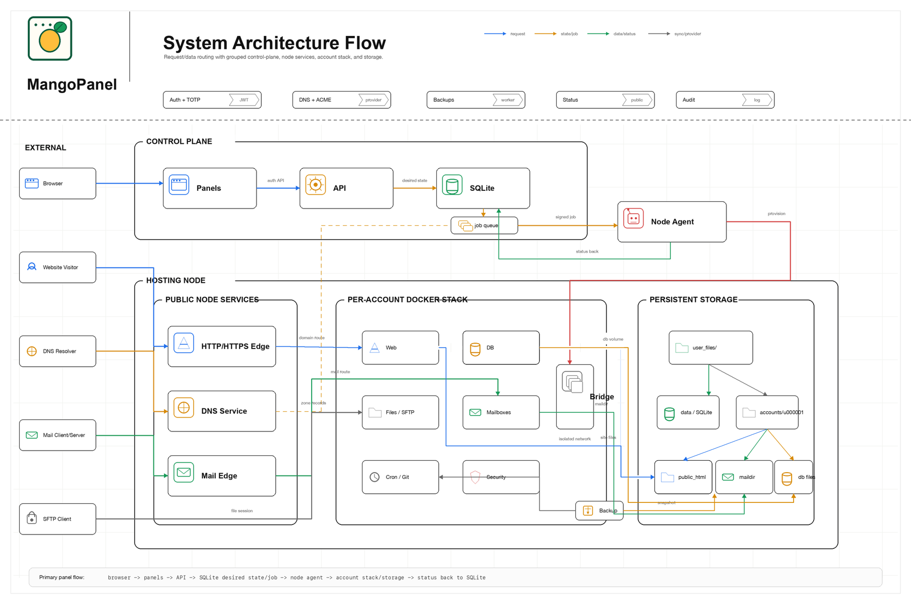

# MangoPanel

MangoPanel is an hPanel-style shared hosting control panel. This repository currently contains the first foundation build from `Project.md`: a runnable API, SQLite control-plane database, Vue CDN client/admin/status pages, dev seed data, and smoke tests.

## Current Build

- Python standard-library HTTP API.
- SQLite schema and development seed data.
- JWT-style signed access tokens.
- Mandatory TOTP flow, with development-only code `000000`.
- Public client signup page at `/signup`.
- Client panel at `/` on the client port.
- First-admin setup page at `/admin` when no admin exists, and `/admin/setup` for explicit setup checks on the admin port.
- Admin panel at `/admin` on the admin port.
- Public status page at `/status` on the client port.
- Development API coverage for hosting accounts, websites, DNS records, SSL jobs, launch tokens, databases, mailboxes, backups, cron jobs, Git deployments, jobs, audit logs, and status incidents.
- Node-agent job runner with simulated and Docker Compose execution modes.
- Account-stack generator for OpenLiteSpeed, Filebrowser, phpMyAdmin, MariaDB, cron, SFTP, and shared-mail-edge/mailbox-storage scaffolding.
- DNS provider foundation and delegated sync with admin DNS settings, local PowerDNS/Cloudflare provider records, encrypted Cloudflare token storage, per-plan DNS policy fields, client DNS policy enforcement, provider migration, nameserver verification, zone export snapshots, and agent-backed provider publishing.

This is not the production hosting runtime yet. The agent now generates account filesystem layout and Docker Compose files, but real ACME and quota enforcement still need their production providers.

## Quick Start

Fresh clone with `git`:

```bash
git clone https://github.com/servermango/MangoPanel.git MangoPanel && cd MangoPanel && bash scripts/install.sh
```

If `git` is not installed:

```bash
mkdir MangoPanel && curl -fsSL https://codeload.github.com/servermango/MangoPanel/tar.gz/refs/heads/main | tar -xz -C MangoPanel --strip-components=1 && cd MangoPanel && bash scripts/install.sh
```

That tarball path installs `git`, then initializes the repo metadata and sets `origin` to `https://github.com/servermango/MangoPanel.git` so future `git pull` updates work normally.

```bash
cd MangoPanel
make install # install system prerequisites, Python env, Docker tooling, and pre-pull project images
make dev-init   # check Python, Docker, and ports
make dev-up     # start the client + admin panels (seeds dev data on first run)
```

Then open the client panel at <http://127.0.0.1:8000/> and the admin panel at <http://127.0.0.1:8001/admin>, or use the public IP shown in the startup banner if you are on a server. Log in with the seed credentials below (TOTP code `000000` in dev mode). That's all you need for day-to-day work; the rest of this document explains how the pieces fit together.

## Service Command

MangoPanel includes a portable service wrapper at [`scripts/service`](scripts/service). It manages the panel with a PID file and log file, so it works the same way on Linux and macOS without depending on `systemd` or `launchd`.

```bash
bash scripts/service mangopanel start
bash scripts/service mangopanel status
bash scripts/service mangopanel restart
bash scripts/service mangopanel stop
```

If you prefer `make`, the same wrapper is exposed as:

```bash
make service ACTION=start
make service ACTION=status
make service ACTION=restart
make service ACTION=stop
```

By default it runs the production-style panel process in the background and writes logs to `var/mangopanel.log`. You can override ports and paths with the same `MP_*` environment variables the app already uses, plus:

- `MANGOPANEL_PID_FILE`
- `MANGOPANEL_LOG_FILE`
- `MANGOPANEL_PYTHON`

The wrapper starts the app with `MP_ENV=production` unless you set a different value before calling it.

## How It Works

MangoPanel is a single Python program ([`mangopanel/app.py`](mangopanel/app.py)) that serves two HTTP panels and an API, backed by one SQLite database. There is no external web framework — it uses only the standard library.

- **Two panels, two ports.** `make dev-up` starts one process that binds two ports: the client panel on `8000` and the admin panel on `8001`. Each port only serves its own routes (`/api/client/*` vs `/api/admin/*`), so the panels stay isolated. Public routes (`/api/public/*`, `/status`) are reachable from either.
- **Auth.** Login is two steps: email + password returns a short-lived challenge token, then a TOTP code exchanges it for an access token (a signed JWT). In development, `MP_DEV_AUTH_TEST_MODE=true` accepts the bypass code `000000`. All access tokens are checked on every `/api/client` and `/api/admin` request.
- **Control plane (SQLite).** Every panel action writes desired-state rows (users, hosting accounts, websites, databases, mailboxes, etc.) and an audit/activity entry. The API never touches Docker or the filesystem directly.
- **Node agent.** State-changing actions enqueue a row in the `jobs` table. The agent ([`mangopanel/agent.py`](mangopanel/agent.py)) picks up jobs and does the privileged work — creating the account directory layout and rendering Docker Compose files ([`mangopanel/stack.py`](mangopanel/stack.py)). In dev, `MP_AGENT_INLINE=true` runs jobs immediately in `simulate` mode (files written, no containers). Set `MP_AGENT_MODE=docker` to actually launch per-account containers (OpenLiteSpeed, Filebrowser, phpMyAdmin, MariaDB, cron, SFTP, and the mailbox storage/routing scaffolding that will sit behind the shared mail edge).
- **Config.** Everything is driven by environment variables read in [`mangopanel/config.py`](mangopanel/config.py) (`MP_*`), with sensible local defaults — so the Makefile targets work with no setup.

Request flow in one line: **browser → panel API (writes SQLite + enqueues job) → agent (provisions files/containers) → status reported back to SQLite → panel shows result.**



## Thesis Integration Direction

MangoPanel is also being considered as a practical case study for Tariq Abdullah's [Cloud Definition Language](https://github.com/tariq-abdullah/cloud-definition-language) M.Tech thesis work.

The integration would explore how a real shared-hosting platform can express infrastructure intent at a semantic level: hosting accounts, workloads, network boundaries, DNS, certificates, mail routing, storage, quotas, backups, and deployment constraints. That intent could then be compiled into environment-specific artifacts while preserving explainability and reporting where behavior is exact, partial, degraded, or unsupported.

This direction is exploratory and will be introduced incrementally alongside the existing MangoPanel runtime.

## Data Layout

All persistent state lives in a single `user_files/` directory in the project root, so a server admin can reach customer files and the database in one place: 

```text
user_files/
  accounts/                 # per-customer hosting files  (MP_ACCOUNT_ROOT)
    u000001/
      account.json
      domains/<domain>/public_html/
      databases/  mail/  backups/  ssl/  git/  .runtime/
  data/                     # control-plane database       (MP_DATA_DIR)
    mangopanel.sqlite3
```

Override the location with `MP_USER_FILES_DIR` (or the more specific `MP_ACCOUNT_ROOT` / `MP_DATA_DIR` / `MP_DB_PATH`). `user_files/` is git-ignored. `make dev-reset` deletes it for a clean slate.

## Local Development

Run the setup checks:

```bash
make dev-init
```

Start the local panel only:

```bash
make dev-up
```

This is the fast API-first path. It brings up the client/admin panels and runs the agent in simulated mode, so it writes stack files and state but does not launch the per-account Docker containers.

Start the full local hosting stack:

```bash
make dev-up-docker
```

This is the recommended path when you want the complete dev environment, including File Manager, phpMyAdmin, per-account web stacks, mail services, and the local PowerDNS container. It requires Docker Desktop to be running.

Open:

- Client: <http://127.0.0.1:8000/>
- Admin: <http://127.0.0.1:8001/admin>
- Status: <http://127.0.0.1:8000/status>

Seed credentials:

- Admin: `admin@mango.test`
- Customer: `owner@example.mango.test`
- Password: `ChangeMe-DevOnly-123!`
- TOTP code in dev mode: `000000`

Client signup:

- Open <http://127.0.0.1:8000/signup>
- The page calls `POST /api/public/signup`
- The API returns a TOTP secret and creates an initial hosting account when a plan and node are available

First admin setup:

- If the database has zero admins, `/admin` on the admin port shows the first-admin setup page
- The setup page calls `POST /api/public/admin-setup`
- Once an admin exists, first-admin setup is locked
- Existing admins can add more admins from the admin dashboard

Run tests:

```bash
make test 
```

Run the API smoke test while the dev server is running:

```bash
make dev-smoke
```

Run queued agent jobs manually:

```bash
make dev-agent
```

The development server uses `MP_AGENT_INLINE=true` by default, so API-created jobs are processed immediately in simulated mode. Generated account stack files are written under `user_files/accounts/u000001/` unless `MP_ACCOUNT_ROOT` is changed. See [Data Layout](#data-layout) for the full directory map.

If you start the full system with `make dev-up-docker`, it brings up the per-account Docker stack in the same process. Then, in another terminal:

```bash
make dev-hosting-smoke
```

The local Docker stack exposes:

- Website: `http://127.0.0.1:18010`
- Filebrowser: `http://127.0.0.1:18011`
- phpMyAdmin: `http://127.0.0.1:18012`
- Mail web UI: `http://mail-u000001.localhost/webmail`
- SMTP submission: `127.0.0.1:587`
- SMTPS: `127.0.0.1:465`
- IMAP: `127.0.0.1:143`
- IMAPS: `127.0.0.1:993`
- POP3: `127.0.0.1:110`
- POP3S: `127.0.0.1:995`
- ManageSieve: `127.0.0.1:4190`
- MariaDB: `127.0.0.1:18014`
- SFTP: `127.0.0.1:18015`

Additional accounts get their own port range.

Optional local authoritative DNS for the Docker compose profile is provided by `mangopanel-dns`, a PowerDNS Authoritative container with its API exposed on `http://127.0.0.1:8081/api/v1` and DNS on `127.0.0.1:5353`. The panel container is preconfigured to publish managed zones to this service through `MP_POWERDNS_API_URL` and `MP_POWERDNS_API_KEY`.

Reset local data:

```bash
make dev-reset
```

## Docker Development

`make dev-up` is the lightweight dev target and is best for panel/API work. If you want the full per-account stack, use `make dev-up-docker` instead.

The initial compose file runs the panel container:

```bash
docker compose -f docker-compose.dev.yml up --build
```

To let the agent apply generated account stacks with Docker Compose instead of only writing files:

```bash
MP_AGENT_MODE=docker make dev-agent
```

Keep the default `simulate` mode for fast M1 development. Docker mode may pull large third-party images and should be tested separately.

## Next Implementation Steps

1. Add DNSSEC controls, scheduled background nameserver verification, and production deployment docs for public port 53.
2. Implement the shared mail edge from `Project.md` with mailbox CRUD, MX/inbound routing, SPF/DKIM/DMARC, SMTP/POP/IMAP/JMAP, one-click webmail launch from the client panel, and independent per-mailbox webmail login URLs.
3. Add browser E2E tests for the client/admin/status pages.
4. Add the Linux quota test profile for real storage and inode enforcement.
5. Harden Docker mode with image pinning, health checks, and per-service secrets.

### Three-Phase Plan For The Next Two Steps

The first two implementation steps belong together, so the cleanest way to land them is to treat them as one small program split into three passes.

**Phase 1: Shared interfaces and control-plane schema — implemented**
- Add provider interfaces for DNS, ACME, and mail-edge routing so the local development adapters and production adapters share the same contract.
- Extend the control-plane schema for managed zones, certificate state, mailbox routing metadata, and mailbox-scoped launch tokens.
- Add seed data and fixtures for one managed domain, one certificate target, and one mailbox/domain pair that exercises the new flow end to end.
- Keep current routes, payloads, and UI fields intact while the new paths are introduced.

**Phase 2: Local providers and mail edge — implemented**
- Implement the local DNS provider and local ACME provider so the dev stack can create zones, issue certificates, and renew them through the same API used in production.
- Implement the shared mail edge so mailbox CRUD, MX/inbound routing, SPF/DKIM/DMARC, SMTP submission, POP/IMAP, JMAP, and webmail launch all share one routing manifest.
- Wire the client panel to display provider state, routing state, and launch URLs without exposing low-level provider details.
- Add the first browser/API smoke coverage for DNS lookup, certificate issuance, mailbox launch, and direct mailbox login.

**Phase 3: Hardening and promotion — implemented**
- Verify the browser and API flows on the local stack before marking either step complete.
- Add unauthorized, ownership, bad-input, and security-abuse coverage for every new route and job.
- Keep the implementation additive until the API, agent, and UI all agree on the native workflow.
- Only flip the checklist items after the local providers are stable and the smoke tests pass repeatedly.
