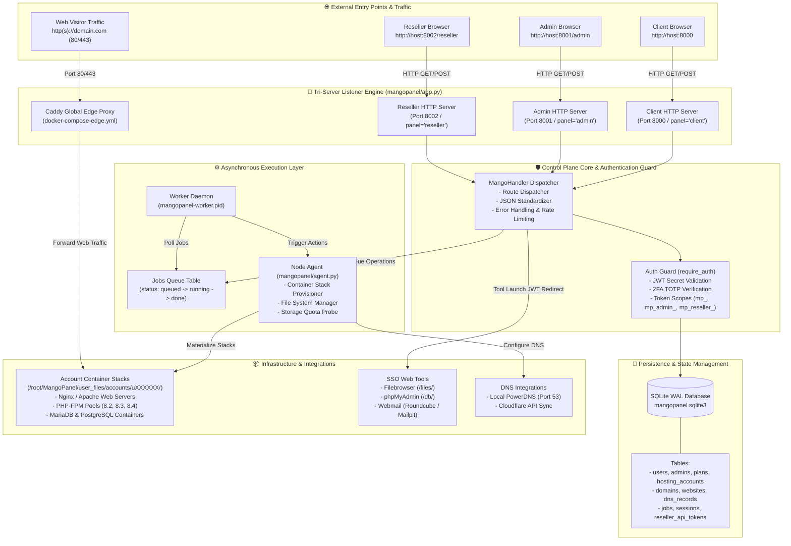

# 🏗️ MangoPanel System Architecture Documentation

This document provides a comprehensive, end-to-end technical overview of **MangoPanel** — covering its multi-port control plane engine, zero-framework Python core, SQLite WAL database layer, job queue dispatcher, containerized hosting account stacks, single sign-on tools, and DNS provider integrations.

---

## 🎨 System Architecture Diagram


---

## 🔌 Listening Ports & Network Routing Matrix

| Port | Interface / Service | Protocol | Target Handler / Entry File | Description |
| :--- | :--- | :--- | :--- | :--- |
| **8000** | Client Area Panel | HTTP / WebSocket | `PUBLIC_DIR / "client.html"` & `/api/client/` | Primary user control panel for managing websites, databases, mailboxes, SSL, and files. |
| **8001** | Admin Area Panel | HTTP / WebSocket | `PUBLIC_DIR / "admin.html"` & `/api/admin/` | Superadmin control panel for managing nodes, hosting plans, storage cleanup, system status, and admin API tokens. |
| **8002** | Reseller Area Panel | HTTP / WebSocket | `PUBLIC_DIR / "reseller.html"` & `/api/reseller/` | Dedicated reseller portal for managing sub-clients, custom sub-plans, account stack provisioning, and reseller API keys. |
| **80** | Caddy Edge Proxy | HTTP | `docker-compose-edge.yml` | Inbound HTTP web traffic router. Automatically redirects to HTTPS or proxies to account containers. |
| **443** | Caddy Edge Proxy | HTTPS | `docker-compose-edge.yml` | Inbound TLS web traffic router. Terminates SSL and forwards requests to containerized web apps. |
| **53** | PowerDNS Authoritative | DNS (UDP/TCP) | Local PowerDNS / API | Authoritative DNS server serving customer domain zones and DNS records locally. |

---

## 🗺️ System Component Block Diagram & Data Flow



---

## 🔍 Request Tracing & End-to-End Workflows

### 1. Client Control Panel Request (`Port 8000`)
1. **User Action**: Client opens `http://host:8000` and logs in with email and password.
2. **Tri-Server Handling**: `client_httpd` (panel = `client`) receives the POST to `/api/client/auth/login`.
3. **Authentication**: `MangoHandler.login("user")` verifies credentials against the `users` table. If TOTP 2FA is active, a TOTP challenge JWT is returned. Upon verification, an access JWT is issued.
4. **Data Retrieval**: Subsequent requests carry `Authorization: Bearer <JWT>` or `mp_<hex>` API tokens. `require_auth("user")` resolves the user's primary `hosting_account`.
5. **Response**: Data is served from `mangopanel.sqlite3` in JSON format.

---

### 2. Admin Infrastructure & Plan Request (`Port 8001`)
1. **User Action**: Admin opens `http://host:8001/admin` and creates a hosting plan with `is_reseller = 1`.
2. **Tri-Server Handling**: `admin_httpd` (panel = `admin`) receives `POST /api/admin/plans`.
3. **Permission Check**: `require_auth("admin")` validates that the token belongs to an active superadmin or an Admin API token with `clients.manage` scope.
4. **Persistence & Audit**: `validate_plan_payload` validates numeric bounds and inserts the plan into `plans`. An audit log entry is recorded in `activity_logs`.

---

### 3. Reseller Sub-Client & Sub-Plan Request (`Port 8002`)
1. **User Action**: Reseller opens `http://host:8002/reseller` and creates a custom sub-plan package for their sub-clients.
2. **Tri-Server Handling**: `reseller_httpd` (panel = `reseller`) receives `POST /api/reseller/plans`.
3. **Reseller Plan Verification**: `route_reseller_api()` queries `hosting_accounts` and `plans` to confirm the reseller's account is active and `is_reseller = 1`.
4. **Package Limits Enforcement**: The requested RAM, storage, max websites, and max databases are checked against the reseller's master plan limits. If sub-plan limits exceed master limits, `400 BAD REQUEST` is raised.
5. **Persistence**: Sub-plan is created with `reseller_id = actor.id`.

---

### 4. Single Sign-On (SSO) Tool Launch Request (Filebrowser / phpMyAdmin / Webmail)
1. **User Action**: Client clicks "Open File Manager" in Client Panel (`Port 8000`).
2. **Token Generation**: Client API returns an SSO launch URL containing a short-lived, single-purpose JWT:
   `/api/public/tool-launch/filebrowser/auth/<JWT>`
3. **Public Gateway**: `MangoHandler.public_tool_launch()` verifies JWT signature and purpose (`tool_launch`).
4. **Session Cookie Injection**: The server sets an HTTP-only authentication cookie (`mp_access_token` or `mp_mail_token`) and returns `302 FOUND` redirecting to the tool path (`/files/` or `/db/`).

---

### 5. Asynchronous Job Queue & Node Agent Execution
1. **Job Enqueue**: A change in website PHP version or SSL order calls `enqueue_agent_job()`, inserting a record into the `jobs` table (`target_type`, `target_id`, `status='queued'`).
2. **Worker Daemon**: `start_worker_daemon()` periodically checks `mangopanel-worker.pid` and polls `jobs` for pending tasks.
3. **Agent Materialization**: `Agent.apply_account()` reads account configuration from SQLite and writes runtime files:
   - Account directory: `/root/MangoPanel/user_files/accounts/uXXXXXX/`
   - Nginx/Apache configs, PHP-FPM pool definitions, and `docker-compose.yml`
4. **Container Orchestration**: The agent runs `docker compose up -d` for account stacks and reloads the global `mangopanel-edge` network.
5. **Job Completion**: Job status is updated to `done` or `failed`.

---

## 📁 System Directory & File Structure

```
/root/MangoPanel/
├── mangopanel/                  # Python Core Control Plane
│   ├── app.py                   # Tri-Server HTTP Engine, Dispatcher, Auth & API Handlers
│   ├── db.py                    # Database Schema Migrations, Connection Pool & Dev Seeds
│   ├── agent.py                 # Node Agent Infrastructure Provisioner & Quota Probe
│   ├── config.py                # System Configuration & Environment Parsing
│   ├── stack.py                 # Account Container Stack Builder
│   └── providers.py             # DNS, ACME, and Mail Edge Integrations
├── public/                      # Static Web Application Interfaces
│   ├── client.html              # Client Control Panel UI
│   ├── admin.html               # Admin System Panel UI
│   ├── reseller.html            # Reseller Hosting Panel UI
│   ├── docs.html                # Platform Documentation
│   ├── status.html              # System Status Page
│   └── assets/                  # JS, CSS, Icons & Architecture Diagrams
├── docs/                        # Technical System Documentation & Schematics
├── user_files/accounts/         # Containerized Account Stacks
│   └── uXXXXXX/                 # Individual Isolated Account Directory
│       ├── .runtime/            # Docker Compose & Service Configs
│       ├── domains/             # Website Document Roots (public_html)
│       └── logs/                # Access & Error Logs
├── tests/                       # Automated Test Suite (200+ Unit Tests)
├── var/                         # Runtime Locks, PIDs, and Logs
└── docker-compose-edge.yml     # Global Caddy Edge Proxy Manifest
```
